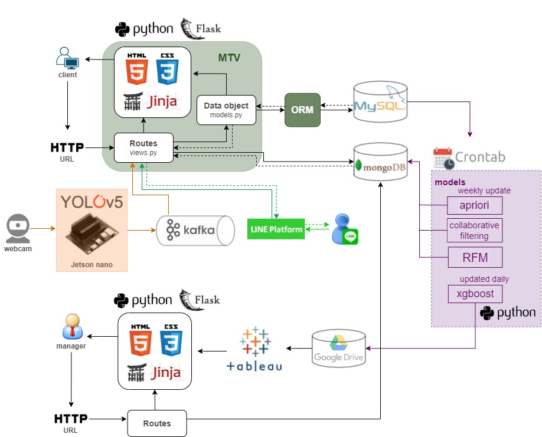
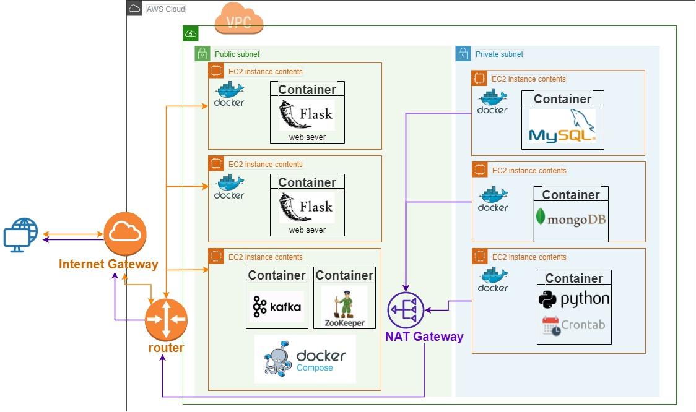
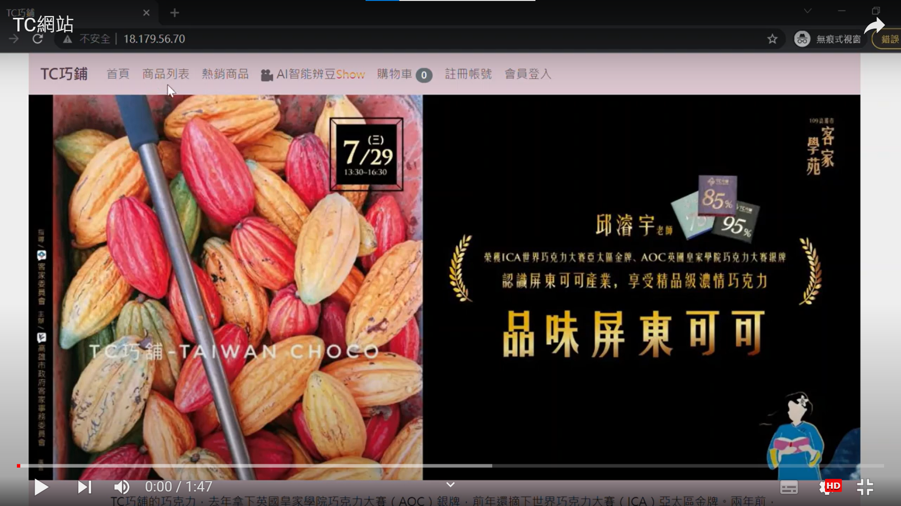

## Cocoa Web Framework
### 可可豆智能篩檢機暨電商推薦系統與客戶分析
 與屏東可可小農商家合作，導入AI人工智慧技術，降低人力成本，並透過分析訂單銷售以達到提高營收
* 使用DL Yolov5模型達成影像辨識瑕疵檢測
* Jetson nano/Raspberry Pi AIOT整合
* 訂單預測、資料庫設計、RFM及購物籃分析
* 協同過濾推薦系統
* 電商Flask網頁建構及AWS雲端部署
* 瑕疵檢測Kafka即時串流系統整合

## System Architecture

## Cloud Architecture

## Web Video Demo

